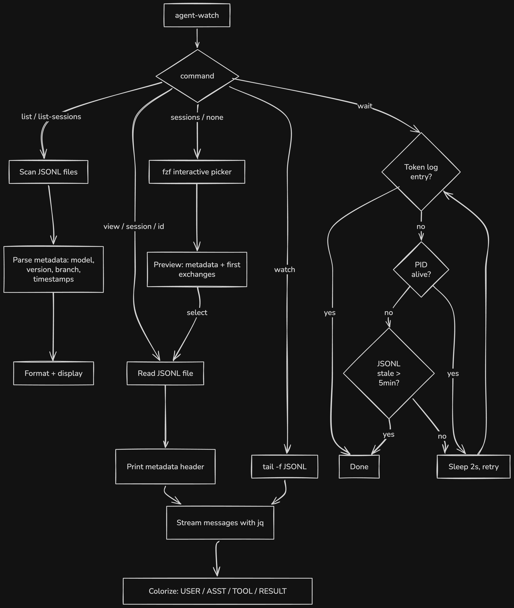

# agent-watch

CLI tool for monitoring and browsing Claude Code sub-agent and session transcripts.

## Core Features

### Session & Agent Browsing

View and search through Claude Code session history and sub-agent transcripts. All views display rich metadata headers showing model, version, branch, project, timestamps, message count, and token usage breakdown. Auto-detects whether an ID is a session or agent.

### Agent Orchestration (`wait`)

Block until one or more sub-agents complete. Essential for parallel agent workflows. Uses up to three detection methods:

1. **Token log** -- instant detection via hook-based completion entries
2. **PID liveness** -- checks if the Claude process is still running via `kill -0`
3. **JSONL staleness** -- fallback: no activity for 5 minutes = presumed complete

**The PID hook is required for robust `wait` behavior.** Without it, `wait` falls back to JSONL staleness, which will incorrectly presume an agent is dead if it's alive but idle for >5 minutes (e.g. long tool execution, slow model response). See the [setup guide](https://github.com/restot/agent-watch/wiki/Token-Log-Setup) to configure hooks.

### Interactive Mode

fzf-based selection with preview panels showing metadata and first exchanges. Browse sessions or agents, then view, watch live, or open full transcripts.

### Pagination

Navigate large sessions without loading everything into memory. `--limit` sets a token budget (chars/4), `--offset` skips messages. Output includes `NEXT_OFFSET=M` for continuation.

### Agent-Safe Commands

Non-interactive commands (`list`, `list-sessions`, `view`, `session`, `wait`) are safe for use by Claude Code agents themselves -- no TTY required.

### Live Tailing

Stream agent output in real-time with colorized role markers (`[USER]`, `[ASST]`, `[TOOL]`, `[RESULT]`).

## Installation

### Dependencies

- **bash 4+** (macOS ships bash 3 -- install via `brew install bash`)
- **jq** -- JSON parsing (`brew install jq`)
- **fzf** -- interactive selection and previews (`brew install fzf`), only needed for interactive mode
- **bc** -- token formatting (optional, usually pre-installed)

### Install

```sh
curl -fsSL https://github.com/restot/agent-watch/releases/latest/download/agent-watch \
  -o ~/.local/bin/agent-watch && chmod +x ~/.local/bin/agent-watch
```

Verify it's in your `PATH`:

```sh
which agent-watch
```

If not found:

```sh
echo 'export PATH="$HOME/.local/bin:$PATH"' >> ~/.$(basename "$SHELL")rc
```

Restart your shell or run `exec $SHELL` to apply.

### Teach your agents

Append the agent-watch reference to your global Claude Code memory:

```sh
curl -fsSL https://raw.githubusercontent.com/restot/agent-watch/main/CLAUDE.md >> ~/.claude/CLAUDE.md
```

## Usage

```
Usage: agent-watch [command] [args] [flags]

Non-interactive commands (safe for agents):
  list [count]        List recent sub-agents (default: 20)
  list-sessions [n]   List all sessions (or last n)
    -p, --project <name>  Filter by project (case-insensitive partial match)
  view [id]           View agent transcript (most recent if no id)
  session <id>        View a specific session
  <id>                Auto-detect: view agent or session by ID
  wait <id> [id...]   Block until agent(s) complete
  update              Self-update to the latest release

Interactive commands (require TTY):
  (none)              fzf selection of sub-agents
  sessions [id]       fzf browser for sessions (or view specific session by ID)
  watch [id]          Live tail of agent output

All views display a metadata header:
  Model, Version, Branch, Project, Started/Ended, Messages, Tokens
  Sub-agents also show Slug; Permission shown when available.

Pagination (for large sessions/agents):
  --limit N           Token budget (chars/4); prints NEXT_OFFSET=M when exceeded
  --offset N          Skip first N messages (combine with --limit to paginate)

Other flags:
  --debug             Show debug output
  --help              Show this help message
  --version           Show version

Environment:
  AGENT_WATCH_STALE_TIMEOUT   Staleness threshold in seconds for wait fallback (default: 300)
```

## Examples

### Non-interactive (safe for agents)

List the 10 most recent sub-agents:

```sh
agent-watch list 10
```

View the most recent agent transcript:

```sh
agent-watch view
```

View a specific session or agent by ID (auto-detected):

```sh
agent-watch abc123de
```

Filter sessions by project name:

```sh
agent-watch list-sessions -p my-project
```

Paginate through a large session:

```sh
agent-watch session abc123de --limit 5000
# Output includes NEXT_OFFSET=M if truncated
agent-watch session abc123de --offset 50 --limit 5000
```

Wait for sub-agents to finish before continuing:

```sh
agent-watch wait abc123 def456
```

### Interactive (require TTY)

Browse sessions with fzf:

```sh
agent-watch sessions
```

Browse sub-agents with fzf:

```sh
agent-watch
```

Live tail an active sub-agent:

```sh
agent-watch watch
```

## How it works

<details>
<summary>Architecture and internals</summary>

### File structure

```
~/.claude/projects/
  <project>/
    <session-id>.jsonl          <-- main session transcripts
    sessions-index.json         <-- session metadata (prompts, dates)
    subagents/
      agent-<id>.jsonl          <-- sub-agent transcripts

~/.claude/.agent-pids/          <-- PID files (optional, via hooks)
~/.claude/subagent-tokens.log   <-- token log (optional, via hooks)
```

### Flow



### Details

agent-watch reads Claude Code's JSONL session and agent files from `~/.claude/projects/`. It parses metadata from the first few entries in each file (model, version, branch, timestamps) and aggregates token usage across all assistant entries.

JSON parsing is handled by jq. Interactive selection uses fzf with preview windows that show session metadata and recent messages. Output is colorized with role-based markers (`[USER]`, `[ASST]`, `[TOOL]`, `[RESULT]`) for readability.

</details>


## Wiki

See the [wiki](https://github.com/restot/agent-watch/wiki) for advanced setup guides:

- [Token Log & PID Tracking](https://github.com/restot/agent-watch/wiki/Token-Log-Setup) -- Claude Code hooks for faster `wait` detection and token usage logging

## Contributing

1. Fork the repo
2. Create a branch (`git checkout -b my-feature`)
3. Make your changes to the `agent-watch` script
4. Verify syntax: `bash -n agent-watch`
5. Test against real session/agent files
6. Submit a PR

Keep changes minimal and focused. This is a single-file tool -- no build step, no dependencies beyond bash/jq/fzf.

## License

MIT
